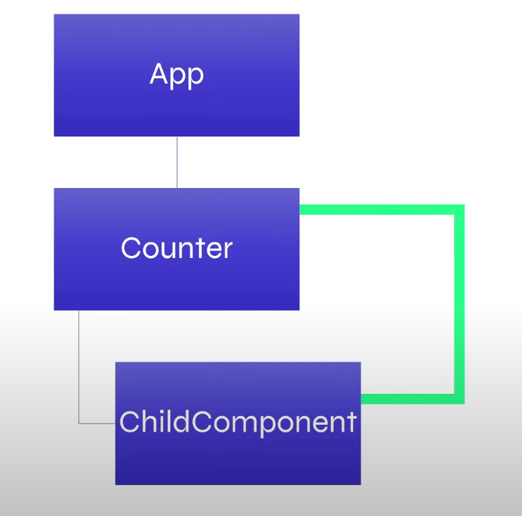
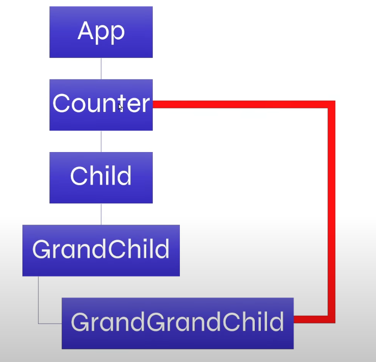

## Prop Drilling

1. It is a pattern where you pass data from a parent component to deeply nested child components through multiple layers of components, even if some intermediate components dont even need the data.

2. As your component tree "deepens", prop drilling can make the code more complex and harder to maintain.

--> We can not pass values ditectly to grandchild or further without passing throught their parents.

--> all the problems will be fixed using context AOP
