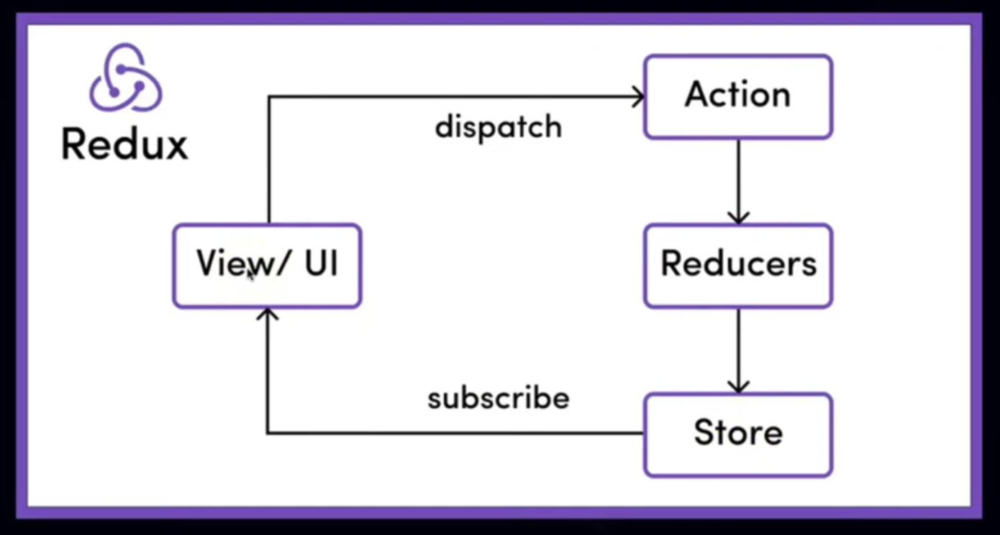

## Redux

1. State management library for js apps.
2. Manage and Centralize apps in a predictable way.
3. Best for large and complex apps.

## Redux vs Redux Toolkit

1. Redux required manual configuration for everything.
2. With RTK everything is packed within.

## Redux worflow



1. View/UI (React components):-
   a. User interacts with UI.
   b. This triggers an "ACTION" to be dispatched.

2. Action:-
   a. An Action is a plain JS Object that describes what happened.
   b. Example:
   ```
      {type:"ADD_TODO", payload:"Learn Redux"}
   ```

c. Actions don't update the state directly, they just describe the event.

3. Dispatch:-
   a. The dispatch() function send the action to the Redux store.
   b. Think of it as "posting a message" about what happened.

4. Reducers:-
   a. Reducers are pure function that take the current state and the action, then return a new state.
   b. Example:

   ```function todosReducer(state = [], action) {
   switch (action.type) {
       case 'ADD_TODO':
       return [...state, action.payload];
       default:
       return state;
    }
   }
   ```

5. Store:-
   a. The store holds the entire application state in one centralized place.

6. Subscribe:-
   a. It applies reducers to update the state when actions are dispatched.
   b. When the store updates, subscribed components re-render with the new state.
